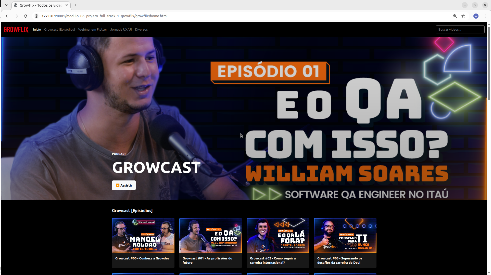

# Growflix

O **Growflix** é uma plataforma de vídeos inspirada em serviços de streaming, desenvolvida como projeto prático do **Módulo 6 — Projeto Full Stack I** da formação **Front-end com ReactJS da Growdev**.

A aplicação reúne Growcasts, webinars e outros conteúdos da Growdev em uma interface responsiva, permitindo navegar pelo catálogo, pesquisar conteúdos e assistir aos vídeos diretamente pela plataforma.

## Projeto online

🔗 [Acessar o Growflix](https://growflix-rho.vercel.app/)

## Preview



## Sobre o projeto

O objetivo do Growflix foi colocar em prática e consolidar conceitos de desenvolvimento front-end estudados ao longo da formação, utilizando HTML, CSS, JavaScript e Bootstrap.

Além da construção da interface proposta no projeto, foram implementadas melhorias relacionadas à organização do código, responsividade, acessibilidade e experiência de navegação.

Entre as principais funcionalidades estão:

- catálogo de vídeos renderizado dinamicamente com JavaScript;
- organização dos conteúdos por categorias;
- busca de vídeos por título ou categoria;
- atualização dinâmica do catálogo durante a pesquisa;
- ocultação automática de categorias sem resultados;
- mensagem para pesquisas sem resultados;
- reprodução dos vídeos em modal;
- suporte à navegação dos cards utilizando teclado;
- layout responsivo para diferentes tamanhos de tela.

## Tecnologias utilizadas

- HTML5
- CSS3
- JavaScript
- Bootstrap 5.3
- Git
- GitHub

## Funcionalidades

### Catálogo dinâmico

Os dados dos vídeos são mantidos separadamente da lógica da aplicação e utilizados pelo JavaScript para construir os cards dinamicamente.

Os conteúdos são organizados nas categorias:

- Growcast;
- Webinar em Flutter;
- Jornada UX/UI;
- Diversos.

### Busca de vídeos

O campo de busca permite pesquisar conteúdos pelo título ou pela categoria.

Conforme o usuário digita, o catálogo é atualizado dinamicamente. Categorias sem resultados são ocultadas e, caso nenhum vídeo seja encontrado, uma mensagem é apresentada.

### Reprodução de vídeos

Os vídeos podem ser abertos diretamente pelos cards do catálogo ou pelo destaque principal da página.

A reprodução acontece em um modal utilizando o player incorporado do YouTube. Ao fechar o modal, o player é limpo e a reprodução é interrompida.

### Acessibilidade

Os cards do catálogo possuem suporte à navegação por teclado e informações para tecnologias assistivas.

Um vídeo pode ser aberto utilizando:

- clique do mouse;
- tecla `Enter`;
- tecla `Espaço`.

Também foram utilizados elementos semânticos e atributos ARIA em diferentes partes da interface.

### Responsividade

O layout foi desenvolvido para se adaptar a diferentes tamanhos de tela.

Foram utilizados o sistema de grid e as classes responsivas do Bootstrap em conjunto com CSS próprio e media queries para ajustes específicos da interface.

## O que pratiquei neste projeto

Durante o desenvolvimento do Growflix, pude aplicar e reforçar conhecimentos em:

- HTML semântico;
- CSS e organização de estilos;
- Flexbox e Grid;
- responsividade;
- Bootstrap e seu sistema de grid;
- manipulação do DOM;
- criação dinâmica de elementos com JavaScript;
- eventos;
- métodos de arrays como `forEach()`, `filter()` e `some()`;
- uso de `dataset`;
- integração com componentes do Bootstrap;
- acessibilidade;
- Git e organização do histórico de commits.

## Estrutura do projeto

```text
growflix/
├── assets/
│   ├── images/
│   │   └── preview-growflix.png
│   └── libs/
│       └── bootstrap-5.3/
├── css/
│   └── style.css
├── js/
│   ├── app.js
│   └── database.js
├── home.html
├── index.html
└── README.md
```

## Como executar o projeto

Clone este repositório:

```bash
git clone https://github.com/Lucasgyn94/growflix.git
```

Entre no diretório do projeto:

```bash
cd growflix
```

Depois, abra o projeto utilizando um servidor local, como a extensão **Live Server** do Visual Studio Code.

Também é possível abrir o arquivo `index.html` diretamente no navegador.

## Status do projeto

Projeto concluído como atividade prática do **Módulo 6 — Projeto Full Stack I** da formação **Front-end com ReactJS da Growdev**.

Além dos requisitos iniciais, foram implementadas melhorias relacionadas à busca de conteúdos, acessibilidade, organização do código e responsividade.

## Autor

Desenvolvido por **Lucas Ferreira da Silva** durante a formação **Front-end com ReactJS da Growdev**.